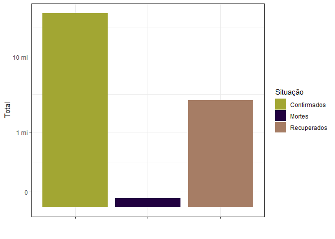

Atividade 7
================

## Número de pessoas afetadas pelo Covid-19.

    ## Warning: package 'ggplot2' was built under R version 4.0.2

<!-- -->

## Os países com os maiores casos de Covid-19.

<!-- -->

## Porcentagem do número de pessoas infectadas com o Covid-19 em relação à população mundial.

<!-- -->

## Os cinco países com mais casos de Covid-19.

<!-- -->

## O desenvolvimento do Covid-19 no Brasil.

<!-- -->
