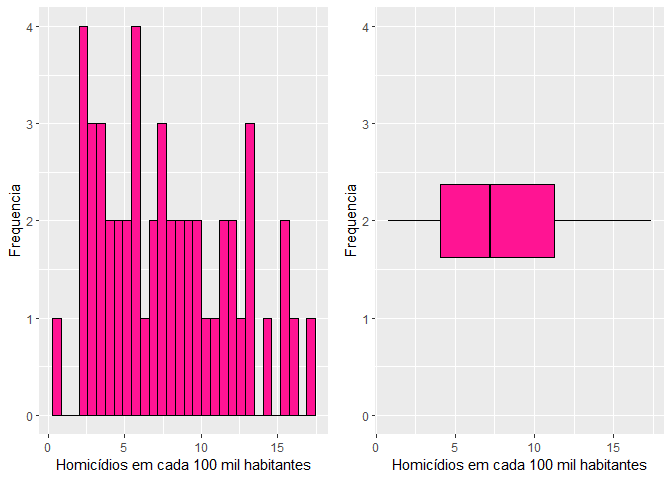
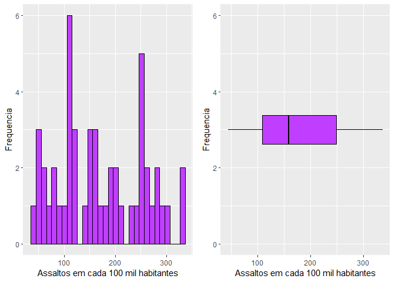
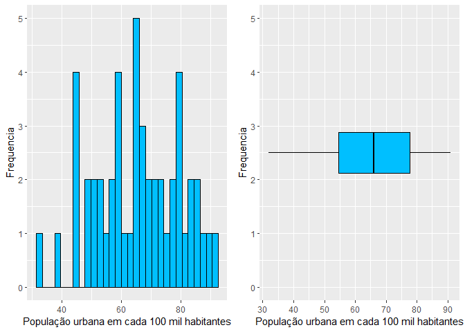
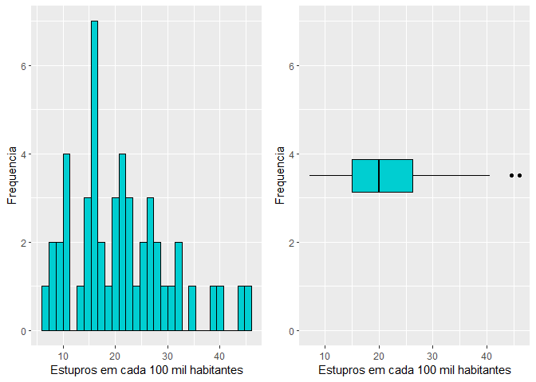
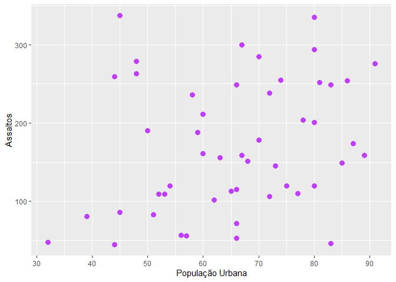
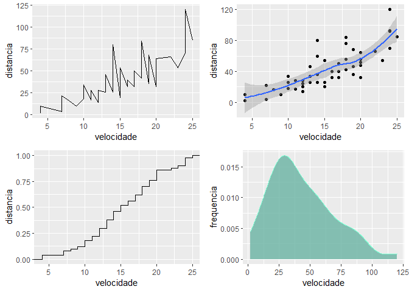
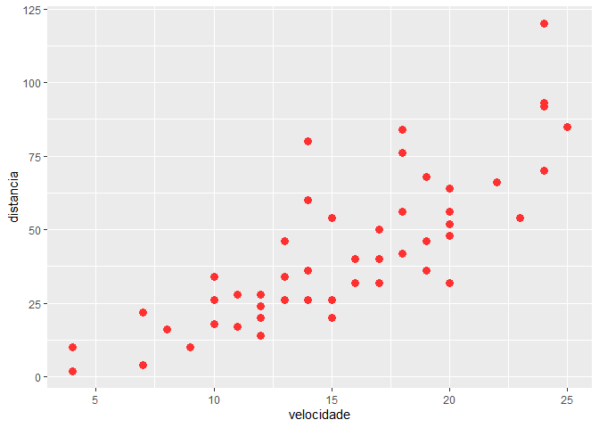

Homework 2
================

Questão 1

    Warning: package 'ggplot2' was built under R version 4.0.2

    [1] "Homicídios em Estados Americanos"

<!-- -->

    [1] "Assaltos em Estados Americanos"

<!-- -->

    [1] "População urbana em Estados Americanos"

<!-- -->

    [1] "Estupros em Estados Americanos"

<!-- -->

Questão 2

    [1] "Relação entre Assaltos e População Urbana"

<!-- -->

Questão 3

    [1] "É possivel identificar que há uma relação entre os dados, alguns possuem linearidade."

<!-- -->

Questão 4

<!-- -->

    [1] "É possivel identificar que se a velocidade aumenta a ditância tambem aumenta, ou seja, algumas delas são proporcionais."
