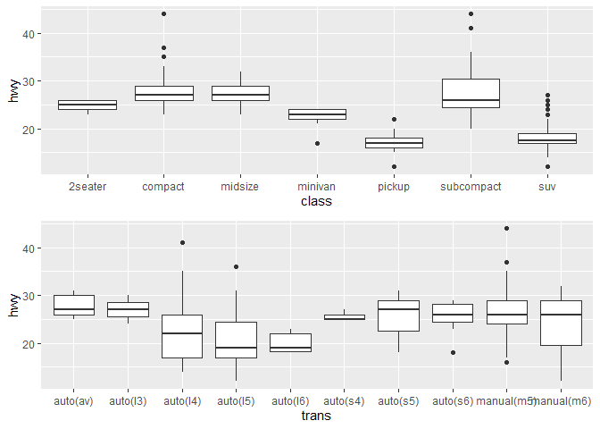

Homework3
================

**Questão 1**

    ## [1] "O argumento 'Data' da função ggplot() é utilizado para receber  o dataframe."

**Questão 2**

    ## Warning: package 'ggplot2' was built under R version 4.0.2

    ## [1] "O camando head mostra as 6 primeiras linhas"

    ## # A tibble: 6 x 11
    ##   manufacturer model displ  year   cyl trans      drv     cty   hwy fl    class 
    ##   <chr>        <chr> <dbl> <int> <int> <chr>      <chr> <int> <int> <chr> <chr> 
    ## 1 audi         a4      1.8  1999     4 auto(l5)   f        18    29 p     compa~
    ## 2 audi         a4      1.8  1999     4 manual(m5) f        21    29 p     compa~
    ## 3 audi         a4      2    2008     4 manual(m6) f        20    31 p     compa~
    ## 4 audi         a4      2    2008     4 auto(av)   f        21    30 p     compa~
    ## 5 audi         a4      2.8  1999     6 auto(l5)   f        16    26 p     compa~
    ## 6 audi         a4      2.8  1999     6 manual(m5) f        18    26 p     compa~

    ## [1] "O comando dim mostra o numero de linhas e colunas"

    ## [1] 234  11

    ## [1] "O comando names apresenta os nomes das colunas"

    ##  [1] "manufacturer" "model"        "displ"        "year"         "cyl"         
    ##  [6] "trans"        "drv"          "cty"          "hwy"          "fl"          
    ## [11] "class"

    ## [1] "O comando tail mostra as ultimas 6 linhas"

    ## # A tibble: 6 x 11
    ##   manufacturer model  displ  year   cyl trans     drv     cty   hwy fl    class 
    ##   <chr>        <chr>  <dbl> <int> <int> <chr>     <chr> <int> <int> <chr> <chr> 
    ## 1 volkswagen   passat   1.8  1999     4 auto(l5)  f        18    29 p     midsi~
    ## 2 volkswagen   passat   2    2008     4 auto(s6)  f        19    28 p     midsi~
    ## 3 volkswagen   passat   2    2008     4 manual(m~ f        21    29 p     midsi~
    ## 4 volkswagen   passat   2.8  1999     6 auto(l5)  f        16    26 p     midsi~
    ## 5 volkswagen   passat   2.8  1999     6 manual(m~ f        18    26 p     midsi~
    ## 6 volkswagen   passat   3.6  2008     6 auto(s6)  f        17    26 p     midsi~

**Questão 3**

<!-- -->

    ## [1] "A relação entre o número de cilindros e milhas por galão não é linear,para concluir algo será necessario avaliar junto com outras variaveis."

**Questão 4**

<!-- -->

    ## [1] "A maioria dos fabricantes implementam em seus carros combustivel regular. Audi, Hyundai, Mercury e Toyota trabalham com apenas 1 tipo de combustivel. "

**Questão 5**

    ## Warning: Ignoring unknown parameters: binwidth, bins, pad
    
    ## Warning: Ignoring unknown parameters: binwidth, bins, pad

<!-- --><!-- -->

**Questão 6**

<!-- --><!-- -->

    ## [1] "Quando o color é alterado para 'cyl' a cor do grafico muda e a legenda vira um degrade. O face_wrap cria varios graficos comparando as instancias dos atributos inseridos"

**Questão 7**

    ## Warning: package 'readxl' was built under R version 4.0.2

<!-- --><!-- --><!-- --><!-- --><!-- -->
